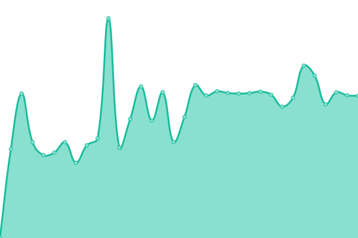
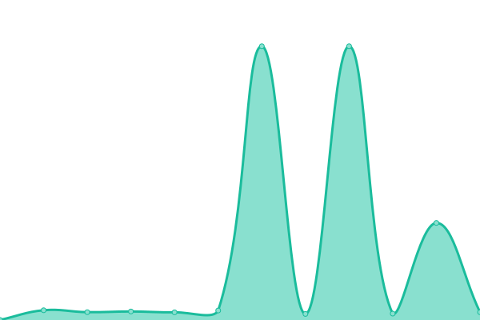
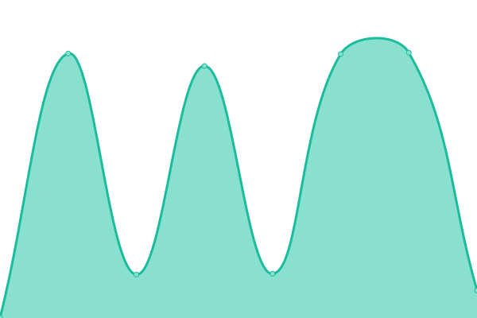

# [📈 Live Status](https://MridulS.github.io/test_status_page): <!--live status--> **🟩 All systems operational**

This repository contains the open-source uptime monitor and status page for [Mridul Seth](mriduls.github.io), powered by [Upptime](https://github.com/upptime/upptime).

With [Upptime](https://upptime.js.org), you can get your own unlimited and free uptime monitor and status page, powered entirely by a GitHub repository. We use [Issues](https://github.com/MridulS/test_status_page/issues) as incident reports, [Actions](https://github.com/MridulS/test_status_page/actions) as uptime monitors, and [Pages](https://MridulS.github.io/test_status_page) for the status page.

<!--start: status pages-->
<!-- This summary is generated by Upptime (https://github.com/upptime/upptime) -->
<!-- Do not edit this manually, your changes will be overwritten -->
<!-- prettier-ignore -->
| URL | Status | History | Response Time | Uptime |
| --- | ------ | ------- | ------------- | ------ |
|  [GESIS Notebooks - Persistent BinderHub](https://notebooks.gesis.org) | 🟩 Up | [gesis-notebooks-persistent-binder-hub.yml](https://github.com/MridulS/test_status_page/commits/master/history/gesis-notebooks-persistent-binder-hub.yml) | 

 764ms
     
 | 

<a href="https://MridulS.github.io/test_status_page/history/gesis-notebooks-persistent-binder-hub">100.00%</a>
    

|  [GESIS Notebooks - BinderHub](https://notebooks.gesis.org/binder) | 🟩 Up | [gesis-notebooks-binder-hub.yml](https://github.com/MridulS/test_status_page/commits/master/history/gesis-notebooks-binder-hub.yml) | 

 367ms
     
 | 

<a href="https://MridulS.github.io/test_status_page/history/gesis-notebooks-binder-hub">100.00%</a>
    

|  [GESIS Notebooks - Gallery](https://notebooks.gesis.org/gallery/) | 🟩 Up | [gesis-notebooks-gallery.yml](https://github.com/MridulS/test_status_page/commits/master/history/gesis-notebooks-gallery.yml) | 

 1719ms
     
 | 

<a href="https://MridulS.github.io/test_status_page/history/gesis-notebooks-gallery">100.00%</a>
    

|  [Persistent BinderHub - Health](https://notebooks.gesis.org/services/binder/health) | 🟩 Up | [persistent-binder-hub-health.yml](https://github.com/MridulS/test_status_page/commits/master/history/persistent-binder-hub-health.yml) | 

 1087ms
     
 | 

<a href="https://MridulS.github.io/test_status_page/history/persistent-binder-hub-health">99.50%</a>
    

|  [Persistent BinderHub - Docker](https://notebooks.gesis.org/services/binder/health) | 🟩 Up | [persistent-binder-hub-docker.yml](https://github.com/MridulS/test_status_page/commits/master/history/persistent-binder-hub-docker.yml) | 

 122ms
     
 | 

<a href="https://MridulS.github.io/test_status_page/history/persistent-binder-hub-docker">100.00%</a>
    

|  [Persistent BinderHub - Hub API](https://notebooks.gesis.org/services/binder/health) | 🟩 Up | [persistent-binder-hub-hub-api.yml](https://github.com/MridulS/test_status_page/commits/master/history/persistent-binder-hub-hub-api.yml) | 

 129ms
     
 | 

<a href="https://MridulS.github.io/test_status_page/history/persistent-binder-hub-hub-api">100.00%</a>
    

|  [BinderHub - Health](https://notebooks.gesis.org/binder/health) | 🟩 Up | [binder-hub-health.yml](https://github.com/MridulS/test_status_page/commits/master/history/binder-hub-health.yml) | 

 1530ms
     
 | 

<a href="https://MridulS.github.io/test_status_page/history/binder-hub-health">100.00%</a>
    

|  [BinderHub - Docker](https://notebooks.gesis.org/binder/health) | 🟩 Up | [binder-hub-docker.yml](https://github.com/MridulS/test_status_page/commits/master/history/binder-hub-docker.yml) | 

 426ms
     
 | 

<a href="https://MridulS.github.io/test_status_page/history/binder-hub-docker">100.00%</a>
    

|  [BinderHub - Hub API](https://notebooks.gesis.org/binder/health) | 🟩 Up | [binder-hub-hub-api.yml](https://github.com/MridulS/test_status_page/commits/master/history/binder-hub-hub-api.yml) | 

 172ms
     
 | 

<a href="https://MridulS.github.io/test_status_page/history/binder-hub-hub-api">100.00%</a>
    

<!--end: status pages-->

[**Visit our status website →**](https://MridulS.github.io/test_status_page)

## 📄 License

- Powered by: [Upptime](https://github.com/upptime/upptime)
- Code: [MIT](./LICENSE) © [Mridul Seth](mriduls.github.io)
- Data in the `./history` directory: [Open Database License](https://opendatacommons.org/licenses/odbl/1-0/)
