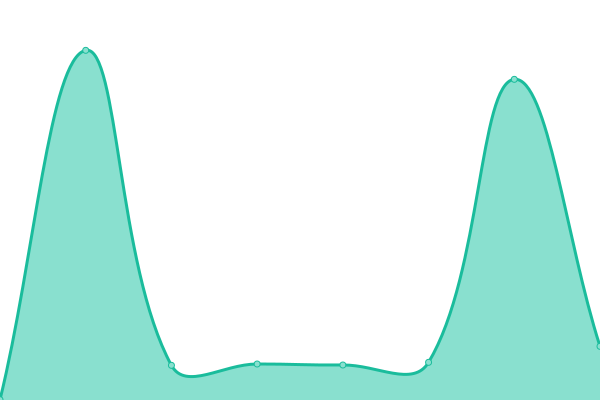

# [📈 Live Status](https://gesisnotebooks.github.io/status): <!--live status--> **🟧 Partial outage**

This repository contains the open-source uptime monitor and status page for [GESIS Notebooks](http://notebooks.gesis.org), powered by [Upptime](https://github.com/upptime/upptime).

With [Upptime](https://upptime.js.org), you can get your own unlimited and free uptime monitor and status page, powered entirely by a GitHub repository. We use [Issues](https://github.com/gesisnotebooks/status/issues) as incident reports, [Actions](https://github.com/gesisnotebooks/status/actions) as uptime monitors, and [Pages](https://gesisnotebooks.github.io/status) for the status page.

<!--start: status pages-->
<!-- This summary is generated by Upptime (https://github.com/upptime/upptime) -->
<!-- Do not edit this manually, your changes will be overwritten -->
<!-- prettier-ignore -->
| URL | Status | History | Response Time | Uptime |
| --- | ------ | ------- | ------------- | ------ |
|  [GESIS Notebooks - Persistent BinderHub](https://notebooks.gesis.org) | 🟥 Down | [gesis-notebooks-persistent-binder-hub.yml](https://github.com/gesisnotebooks/status/commits/HEAD/history/gesis-notebooks-persistent-binder-hub.yml) | 

 3706ms
     
 | 

<a href="https://gesisnotebooks.github.io/status/history/gesis-notebooks-persistent-binder-hub">99.04%</a>
    

|  [GESIS Notebooks - BinderHub](https://notebooks.gesis.org/binder) | 🟩 Up | [gesis-notebooks-binder-hub.yml](https://github.com/gesisnotebooks/status/commits/HEAD/history/gesis-notebooks-binder-hub.yml) | 

 374ms
     
 | 

<a href="https://gesisnotebooks.github.io/status/history/gesis-notebooks-binder-hub">99.50%</a>
    

|  [GESIS Notebooks - Gallery](https://notebooks.gesis.org/gallery/) | 🟩 Up | [gesis-notebooks-gallery.yml](https://github.com/gesisnotebooks/status/commits/HEAD/history/gesis-notebooks-gallery.yml) | 

 1637ms
     
 | 

<a href="https://gesisnotebooks.github.io/status/history/gesis-notebooks-gallery">99.64%</a>
    

|  [Persistent BinderHub - Health](https://notebooks.gesis.org/services/binder/health) | 🟥 Down | [persistent-binder-hub-health.yml](https://github.com/gesisnotebooks/status/commits/HEAD/history/persistent-binder-hub-health.yml) | 

 1573ms
     
 | 

<a href="https://gesisnotebooks.github.io/status/history/persistent-binder-hub-health">99.28%</a>
    

|  [Persistent BinderHub - Docker](https://notebooks.gesis.org/services/binder/health) | 🟥 Down | [persistent-binder-hub-docker.yml](https://github.com/gesisnotebooks/status/commits/HEAD/history/persistent-binder-hub-docker.yml) | 

 890ms
     
 | 

<a href="https://gesisnotebooks.github.io/status/history/persistent-binder-hub-docker">99.29%</a>
    

|  [Persistent BinderHub - Hub API](https://notebooks.gesis.org/services/binder/health) | 🟥 Down | [persistent-binder-hub-hub-api.yml](https://github.com/gesisnotebooks/status/commits/HEAD/history/persistent-binder-hub-hub-api.yml) | 

 781ms
     
 | 

<a href="https://gesisnotebooks.github.io/status/history/persistent-binder-hub-hub-api">99.29%</a>
    

|  [BinderHub - Health](https://notebooks.gesis.org/binder/health) | 🟥 Down | [binder-hub-health.yml](https://github.com/gesisnotebooks/status/commits/HEAD/history/binder-hub-health.yml) | 

 629ms
     
 | 

<a href="https://gesisnotebooks.github.io/status/history/binder-hub-health">99.30%</a>
    

|  [BinderHub - Docker](https://notebooks.gesis.org/binder/health) | 🟥 Down | [binder-hub-docker.yml](https://github.com/gesisnotebooks/status/commits/HEAD/history/binder-hub-docker.yml) | 

 737ms
     
 | 

<a href="https://gesisnotebooks.github.io/status/history/binder-hub-docker">99.32%</a>
    

|  [BinderHub - Hub API](https://notebooks.gesis.org/binder/health) | 🟥 Down | [binder-hub-hub-api.yml](https://github.com/gesisnotebooks/status/commits/HEAD/history/binder-hub-hub-api.yml) | 

 3140ms
     
 | 

<a href="https://gesisnotebooks.github.io/status/history/binder-hub-hub-api">99.33%</a>
    

<!--end: status pages-->

[**Visit our status website →**](https://gesisnotebooks.github.io/status/)

## 📄 License

- Powered by: [Upptime](https://github.com/upptime/upptime)
- Code: [MIT](./LICENSE) © [GESIS Notebooks](https://notebooks.gesis.org)
- Data in the `./history` directory: [Open Database License](https://opendatacommons.org/licenses/odbl/1-0/)
